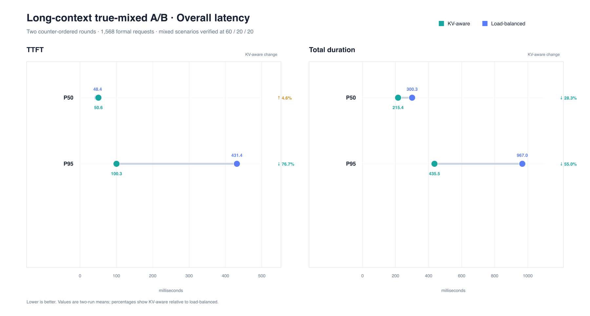
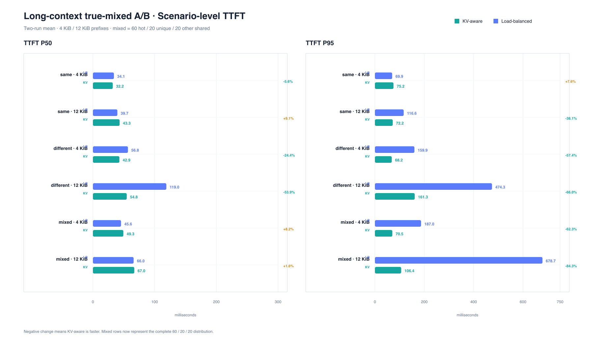
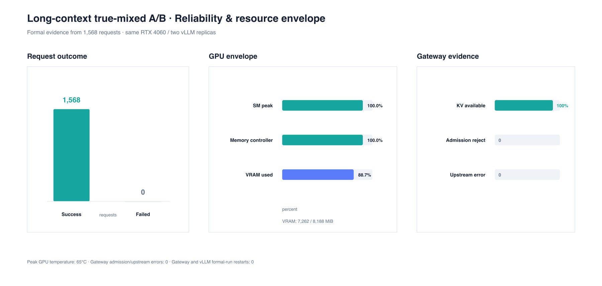
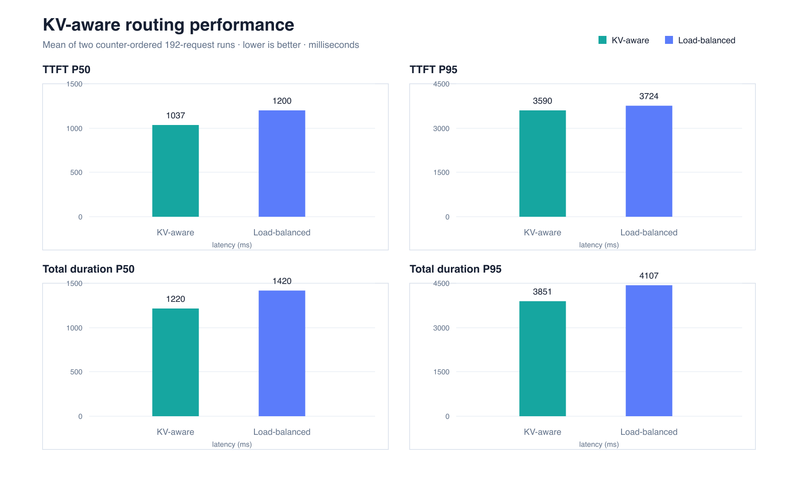
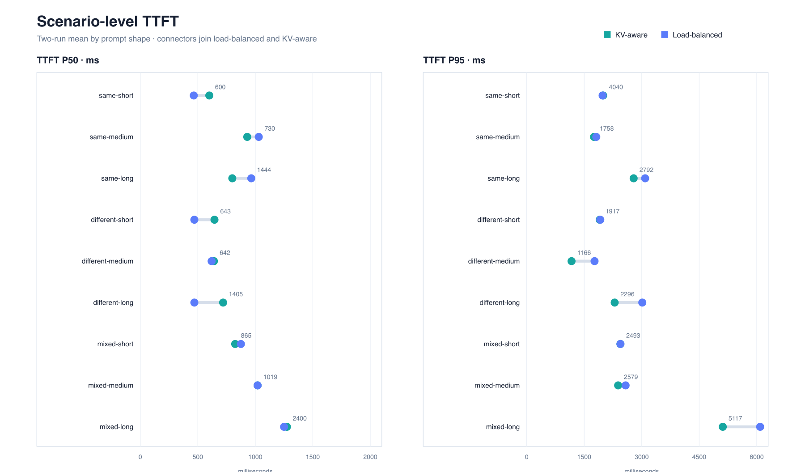
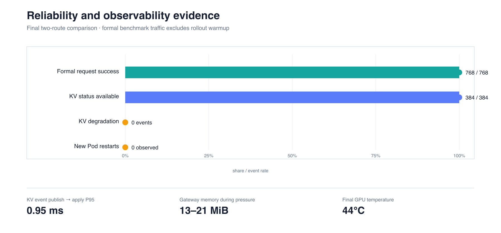

# FishMesh

> A lightweight Kubernetes-native, KV-cache-aware router for self-hosted LLM inference.

[简体中文](README_CN.md)

FishMesh is evolving into a small-cluster alternative to a full inference-gateway stack. Its target primary
runtime is a single Go HTTP/SSE data plane that discovers vLLM Pods, tracks their real KV-cache locality, combines
locality with current load and failure state, and forwards each OpenAI-compatible request directly to the selected
Pod. The current implemented baseline is described separately below.

For platform environments that already operate an Envoy-compatible Gateway, FishMesh also provides a standard
llm-d EPP integration. The two runtimes share one protocol-neutral routing policy; FishMesh does not reimplement
Envoy `ext_proc`, InferencePool, flow control or model execution.

## The problem

A Kubernetes Service balances connections. It cannot answer request-level questions such as:

- which vLLM Pod is Ready, Serving and backed by fresh discovery state;
- which Pod still owns the longest cached prefix for this prompt;
- whether that cache benefit is worth waiting behind the Pod's queued work;
- when a stream cancellation, Pod rollout or telemetry gap must invalidate local state;
- why a request used KV-aware cache routing, degraded to load-balanced or fell back.

Session affinity alone is insufficient. Two unrelated sessions can share a long system prompt and reuse the same
KV blocks, while a restarted Pod may have lost every block associated with an otherwise stable session key.

## Product shape

### Lite mode — primary deliverable

```text
OpenAI client
  -> fishmesh-gateway Service / Deployment
       -> bounded request body
       -> vLLM Render API -> KV-aware token IDs
       -> per-Pod KV index <- vLLM KVEvents
       -> cache + load + health routing
       -> selected vLLM Pod IP
       -> HTTP/SSE passthrough
```

Lite mode does not require Envoy, Gateway API Inference Extension CRDs, EPP, Redis or a FishMesh Operator. It is
intended for small self-hosted pools where a generic Service is too limited and a full shared gateway platform is
unnecessary.

### Standard mode — ecosystem integration

```text
OpenAI client
  -> Envoy-compatible Gateway
  -> llm-d EPP runtime
       -> llm-d token and precise-prefix producers
       -> FishMesh routing policy
       -> llm-d picker / flow control / response lifecycle
  -> vLLM Pod
```

Standard mode targets shared gateways, multiple pools and platform-owned ingress. FishMesh reuses the standard
runtime instead of maintaining another EPP implementation.

## Current implementation status

The deployed baseline already provides:

- OpenAI-compatible HTTP/SSE proxying, cancellation propagation, stream outcome classification and TTFT metrics;
- EndpointSlice watch/list, Ready filtering, periodic relist, freshness and explicit Service fallback;
- per-backend vLLM queue/running observations with per-field validity and age;
- three routing modes: `load-balanced` for ordinary in-flight balancing, `session-key` for a client-supplied
  session key with bounded stickiness, and `kv-aware` for real KV locality plus known load (their policy
  identifiers are `load-balanced-v1`, `session-key-v1`, and `kv-aware-v1`);
- non-blocking admission, per-backend connection bounds, transport-error EWMA circuits and state garbage collection;
- Prometheus routing/discovery/backend metrics and `X-FishMesh-*` request provenance;
- strict configuration, probes, graceful shutdown, least-privilege RBAC and race-tested request lifecycle;
- a pinned llm-d Router v0.9.0 adapter and `fishmesh-epp` composition root with local contract tests.

The R6A–R6B real-signal and request-path work is complete: vLLM Render/KVEvents/replay produced a per-Pod
cross-session match for a shared system prompt, and the Gateway consumes that state for `kv-aware-v1`.
Real eviction, subscriber recovery and Pod replacement remove stale locality; unknown or stale state explicitly
degrades to load-balanced routing rather than masquerading as a zero-token match.

`X-FishMesh-Session-Key` remains an optional compatibility session hint; the KV-aware demo below deliberately omits it
to demonstrate cache reuse across distinct user messages.

## Routing contract

The target policy remains deliberately explainable:

1. exclude terminating, stale, open-circuit or otherwise ineligible endpoints;
2. compute each Pod's real `matched_prefix_tokens` and `uncached_tokens`;
3. estimate queued work and uncached prefill cost from fresh load samples;
4. apply a hard overload guard so cache locality cannot dominate severe pressure;
5. use a small benefit margin/hysteresis to avoid routing churn;
6. degrade from kv-aware to load-balanced when KV state is unavailable or stale;
7. use an optional session hint only as a tie-breaker or short-term stability signal;
8. expose a typed policy, reason, cache source and degradation state for every decision.

FishMesh does not claim a novel routing algorithm. The engineering contribution is a bounded, observable and
operable path from real engine state to a lightweight streaming data plane, plus a standard llm-d integration.

## Five-minute Lite demo

This demo assumes the Lite prerequisites in [`deploy/lite-kv-aware/README.md`](deploy/lite-kv-aware/README.md): a K3s
cluster, the model PV and an importable Gateway image. It first proves the ordinary `load-balanced` default, then
temporarily enables the explicit KV-aware overlay. The optional `session-key` mode is shown by the session-key
experiment overlay. Standard mode / llm-d integration is intentionally deferred.

Verify the repository and the load-balanced baseline:

```bash
make ci

kubectl --kubeconfig ~/.kube/fishmesh.yaml get nodes
kubectl --kubeconfig ~/.kube/fishmesh.yaml -n kubellm get deployment
```

Install the KV-aware overlay and wait for its real KV signal path. The checked-in baseline overlay uses the current
`r6h-degrade-r1` image; the long-context experiment below adds the bounded-connection profile.

```bash
make image VERSION=r6h-degrade-r1
kubectl --kubeconfig ~/.kube/fishmesh.yaml apply -k deploy/lite-kv-aware
kubectl --kubeconfig ~/.kube/fishmesh.yaml -n kubellm rollout status deploy/qwen-vllm --timeout=10m
kubectl --kubeconfig ~/.kube/fishmesh.yaml -n kubellm rollout status deploy/fishmesh-gateway --timeout=5m
kubectl --kubeconfig ~/.kube/fishmesh.yaml -n kubellm port-forward svc/fishmesh-gateway 8080:8080
```

In a second terminal, make two streaming requests with the same long system prompt and different user messages.
Do **not** send `X-FishMesh-Session-Key`; save response headers separately.

```bash
SYSTEM_PROMPT="$(printf 'FishMesh demo policy: answer concisely, state assumptions, preserve streaming semantics, and never reveal hidden reasoning. %.0s' {1..32})"

curl -sS -D /tmp/fishmesh-first.headers -N http://127.0.0.1:8080/v1/chat/completions \
  -H 'Content-Type: application/json' \
  -d '{
    "model": "qwen2.5-0.5b-instruct",
    "messages": [
      {"role": "system", "content": "'"${SYSTEM_PROMPT}"'"},
      {"role": "user", "content": "first request"}],
    "stream": true,
    "max_tokens": 64
  }'

curl -sS -D /tmp/fishmesh-second.headers -N http://127.0.0.1:8080/v1/chat/completions \
  -H 'Content-Type: application/json' \
  -d '{
    "model": "qwen2.5-0.5b-instruct",
    "messages": [
      {"role": "system", "content": "'"${SYSTEM_PROMPT}"'"},
      {"role": "user", "content": "second request"}],
    "stream": true,
    "max_tokens": 64
  }'

grep -iE 'x-fishmesh-(kv-status|policy|route-reason|cached-prefix-tokens)' \
  /tmp/fishmesh-first.headers /tmp/fishmesh-second.headers
```

The first request may correctly show `match-unavailable` with `kv-aware-load-fallback-v1` while replay becomes fresh.
After a valid prewarm, the second should show `available`, `kv-aware-v1`, `kv-aware`, and a
non-zero `X-FishMesh-Cached-Prefix-Tokens`. `available` with zero cached tokens is a real zero match; it is not the
same state as unavailable. Restore the default when finished:
`kubectl --kubeconfig ~/.kube/fishmesh.yaml apply -k deploy/baseline/base`.

The reference cluster runs the `deploy/monitoring` Prometheus + Grafana stack. It has a live Gateway scrape target,
loaded rules and a provisioned `FishMesh Gateway` dashboard. It intentionally has no Alertmanager/notification
receiver, so rules are evaluated and visible but are not delivered externally. See
[`deploy/monitoring/README.md`](deploy/monitoring/README.md) and [`docs/notes/runbook.md`](docs/notes/runbook.md).

## Local client and final pressure test

`fishmesh-client` is the only checked-in external test client; it is not part of the Gateway image.
It streams text while printing the fixed `X-FishMesh-*` decision-header allowlist, TTFT and total duration to stderr.
Keep the port-forward above running, then start a normal multi-turn conversation. If `--history` is omitted, the
client creates a private timestamped file under `~/.local/state/fishmesh/`; pass `--history` when you want to resume
the same conversation later:

```bash
go run ./cmd/fishmesh-client chat \
  --system 'Answer concisely.'
```

```bash
go run ./cmd/fishmesh-client chat \
  --history ~/.local/state/fishmesh/chat.json
```

For the final pressure test, `bench` reads a deterministic matrix of prompt lengths, quantities, batches, same-prefix,
different-prefix and mixed-prefix scenarios. It writes `plan.json`, every request attempt as `requests.jsonl`, and
automatic `report.json`/`report.md` summaries grouped by scenario and batch. Prompt text, raw SSE and API keys are never
written to these artifacts.

```bash
go run ./cmd/fishmesh-client bench \
  --plan configs/final-pressure.json \
  --output-dir artifacts/bench/final-pressure
```

Compare repeated A/B runs without re-reading prompts or raw SSE data:

```bash
go run ./cmd/fishmesh-client compare \
  --baseline artifacts/bench/baseline-r1/requests.jsonl \
  --treatment artifacts/bench/treatment-r1/requests.jsonl \
  --output-dir artifacts/bench/comparison-r1
```

The report includes pooled TTFT percentiles, the median run-level P95, static-estimator error and a deterministic
bootstrap confidence interval. Repeat each arm flag to include more runs.

For cache-isolated token experiments, start from `configs/token-ladder-isolated.json`. Every isolated run records a
workload seed, treatment, unique run nonce and vLLM cache generation. `cold`, `controlled-warm` and `steady-warm`
derive bounded `cache_salt` values without writing them to artifacts. Declared token tiers are accepted only from the
Gateway's actual prompt-token header and fail the run when evidence is missing or outside tolerance.

Omitting `--plan` uses the built-in final matrix. Batches are sequential, requests inside a batch are bounded by the
declared concurrency, and batch pauses give KVEvents/replay time to settle. The client never changes routing mode,
clears cache, rolls Pods or starts another workload.

The client reads an optional `FISHMESH_API_KEY` only for the outgoing authorization header. It never writes that key,
prompts, raw SSE payloads or arbitrary upstream headers into history or benchmark JSONL. It does not switch routing
modes, clear cache, roll Pods or start parallel GPU workloads. `chat` and `request` color the important diagnostic
values on a terminal by default; use `--color never` for plain output or `--color always` when intentionally piping
ANSI output. Benchmark JSONL is always plain.

### Long-context, bounded-connection profile

For the next realistic pressure round, use fewer connections and longer prompts. The checked-in profile uses 4 KiB
and 12 KiB prompt prefixes, multiple batches, and same/different/mixed-prefix scenarios. It keeps Gateway admission at
64 in-flight requests and upstream data connections at 16. The vLLM model remains at `max-model-len=4096`; the 12 KiB
values are prompt bytes, not 12K tokens. Mixed ratios are applied over the full request count of each scenario, so the
client does not silently turn a small mixed scenario into hot-prefix-only traffic.

The KV-aware profile is already prepared as:

```bash
kubectl apply -k deploy/experiments/long-context-kv-aware
kubectl -n kubellm rollout status deploy/fishmesh-gateway --timeout=5m
GATEWAY_IP="$(kubectl -n kubellm get svc fishmesh-gateway -o jsonpath='{.spec.clusterIP}')"
go run ./cmd/fishmesh-client bench \
  --endpoint "http://${GATEWAY_IP}:8080" \
  --plan configs/long-context-balanced.json \
  --run-id long-context-balanced-r6h \
  --output-dir artifacts/bench/long-context-balanced-r6h
```

Run the client inside the cluster or on the GPU node for concurrency tests; a Mac port-forward is useful for smoke
tests but can become the bottleneck. For the A/B baseline, apply `deploy/experiments/long-context-load-balanced` and
reuse the exact same plan and output procedure. Compare success rate, 503 reason, TTFT P50/P95/P99, GPU utilization,
vLLM queue/running, KV availability/degradation, and Gateway RSS before increasing concurrency.

## Measured performance and operational evidence

These figures come from two counter-ordered A/B rounds on the reference cluster. Each routing mode ran the same
deterministic 192-request matrix, covering 256/2048/8192-byte prefixes, same/different/mixed prefix patterns,
multiple batches and bounded concurrency. Rollout warmup traffic is excluded from the formal benchmark totals.

Across the two rounds, KV-aware routing averaged **1036.98 ms vs 1200.28 ms TTFT P50 (-13.6%)** and
**1219.55 ms vs 1420.00 ms total-duration P50 (-14.1%)** against load-balanced routing. For 8 KiB prefixes,
TTFT P50 improved by 9.9%–13.4% in same-prefix and different-prefix scenarios; short-prefix tails remained noisy.
The four formal runs completed **768/768 requests successfully**. All 384 formal KV-aware requests reported an
available KV signal, with no observed KV degradation. KV event publish-to-apply P95 was 0.95 ms, and Gateway memory
during pressure was 13–21 MiB.

The latest true-mixed long-context A/B used two counter-ordered rounds and **1,568 formal requests** with the same
64 in-flight / 16-connection profile. Each mixed scenario was verified from raw JSONL as 60% hot shared prefix, 20%
unique prefixes, and 20% other shared prefixes. KV-aware reduced average TTFT P95 from **431.42 ms to 100.32 ms
(-76.7%)** and duration P95 from **967.00 ms to 435.53 ms (-55.0%)** versus load-balanced. TTFT P50 increased
slightly by 4.6%, so the measured benefit is primarily tail-latency stability rather than every request receiving a
faster first token. See the [full true-mixed comparison report](artifacts/bench/long-context-mixed-comparison-r6h-r2/comparison-report.md).













The machine-readable source reports remain in [`artifacts/bench/`](artifacts/bench/); the image sources are kept beside
the PNGs as SVG files under [`docs/assets/bench/`](docs/assets/bench/).

The R6I token-calibration follow-up replaced arbitrary routing weights with a versioned millisecond profile inside a
measured envelope. On the reference RTX 4060 cluster, static estimation was accurate at low load (2.34–5.44 ms MAE),
but its 2048-token concurrency ladder did not pass the promotion gate: TTFT P95 was 132.64 ms versus 128.62 ms for
token-cost (+3.13%, bootstrap 95% CI crossing zero). FishMesh therefore keeps token-cost as the active/default
estimator and retains static TTFT as an explicit research overlay. See the
[R6I-6 calibration report](docs/experiments/2026-08-16-r6i6-token-ladder.md).

## Delivery priorities

| Priority | Scope | Decision |
| --- | --- | --- |
| Primary | Gateway, request path, routing, discovery, observation, circuit, admission and transport | Productize |
| New core | tokenization, KVEvents/index and kv-aware policy | Complete; Lite KV-aware overlay is available |
| Standard | llm-d adapter, `fishmesh-epp`, Gateway/InferencePool deployment | Keep; complete after Lite MVP |
| Final test tool | `fishmesh-client bench` | Maintain the matrix and report contract |
| Historical | simulator, loadgen, analyst and one-time probes | Removed from the default tree; conclusions remain in stage notes/Git history |
| Excluded | eBPF, Agent actuator, FishMesh CRD/Operator, P/D, shared DB and generic AI Gateway | Outside this MVP |

Historical implementation code is kept recoverable through Git history, while the default tree contains only the
Gateway product, the final client and the active Lite deployment surface.

## Roadmap

1. **R6A–R6C (complete):** real Render/KVEvents/replay, bounded capability domains, KV-aware request path,
   gateway-only Lite image and real rollout/failure acceptance. Monitoring assets are present but not live-validated.
2. **R6D (complete):** bounded Service/load-balanced/KV-aware profiles, including controlled c=1 prefix segments; results
   are correctness/profile evidence only.
3. **Lite release closeout (in progress):** user demo, release artifacts and upgrade/rollback guidance.
4. **R6E — Standard delivery (deferred):** Gateway/HTTPRoute/InferencePool/EPP deployment and wire-level contracts.

Experiments only decide an implementation or verify acceptance; they are not independent product tracks.

## Engineering rules

Go changes follow the mandatory [code organization rules](docs/design/code-organization.md). New capabilities are
implemented in this order: contract and values, contract tests, atomic implementation, orchestration, external
adapter, real-cluster validation and stage documentation. Main orchestration functions keep 3–7 same-level steps;
protocol parsing, block indexing and fallback decisions cannot be mixed into one large function.

Production code uses clear Chinese comments to explain invariants, ownership, cancellation, freshness and
degradation. Comments must explain why the behavior exists, not translate the Go syntax.

See the [project charter](docs/design/project-charter.md), [architecture](docs/design/architecture.md),
[implementation plan](docs/design/plan.md), [ADR-002](docs/design/decisions/002-lite-kv-aware-routing.md) and
[current status](docs/notes/project-status.md).

## Verified environment and limitations

The current cluster is K3s `v1.36.3+k3s1` with vLLM `0.23.0` and two vLLM processes sharing one time-sliced
RTX 4060 Laptop GPU. It is suitable for engine compatibility, routing behavior, failure recovery and relative
overhead. It does not represent two independent GPU failure domains and cannot support production-scale or
horizontal-scaling claims.

Raw benchmark output, logs and cluster snapshots remain outside Git. Repository history contains source,
declarative configuration, schemas and reviewed conclusions only.
