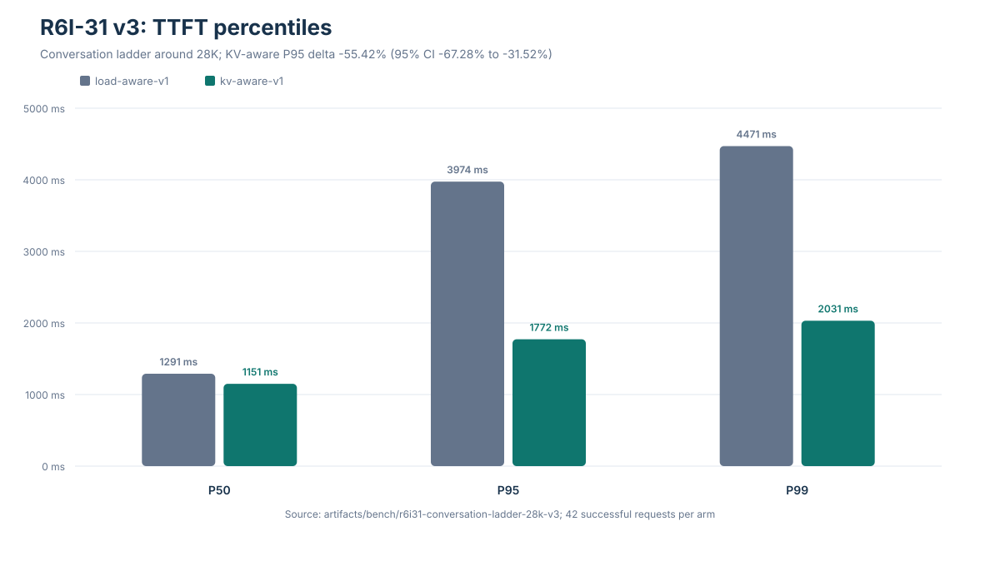
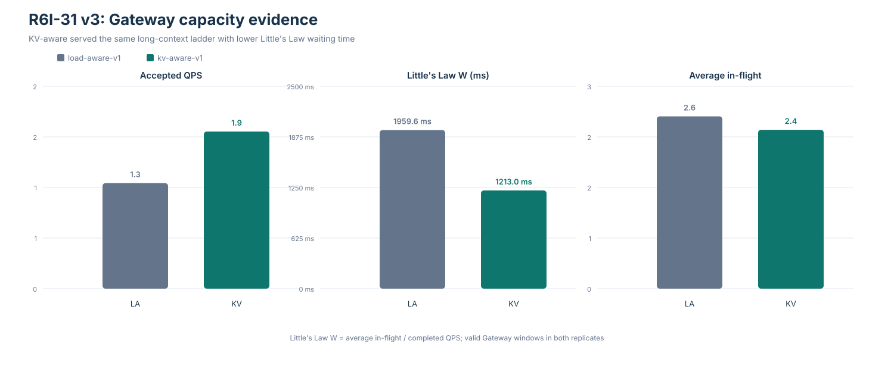
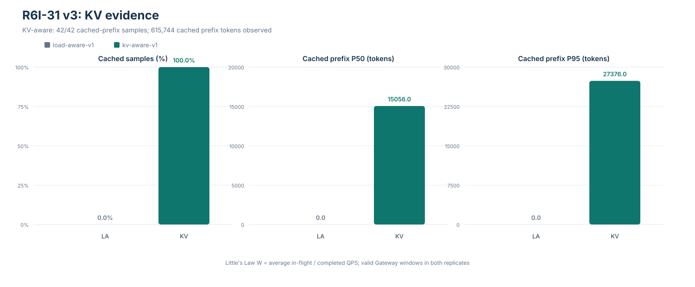

# FishMesh

> 面向自托管 LLM 推理的轻量 Kubernetes 原生 Go 数据面，支持基于 KV cache 的路由。

[English](README.md)

FishMesh 将兼容 OpenAI 的 HTTP/SSE 请求路由到自托管 vLLM Pod。主要产品面是独立运行的 Lite Gateway：它结合
EndpointSlice 发现、实时后端负载、vLLM Render/KVEvents 状态和明确的降级路径。另有 Standard 面，负责将同一份
路由策略接入 llm-d EPP runtime。

FishMesh 面向小型自托管推理池，不替代模型执行、Envoy、Gateway API、流控或通用推理平台。

## 产品形态

| 产品面 | 状态 | 用途 |
| --- | --- | --- |
| Lite Gateway | 主要产品，已实现 | OpenAI 客户端与 vLLM Pod 之间的 Go 数据面 |
| KV-aware 路由 | 显式 overlay，已实现 | 复用新鲜的逐 Pod 前缀证据；证据不可用时降级 |
| Standard llm-d 集成 | adapter 与本地契约测试已具备 | 复用平台管理的 Gateway/EPP runtime |
| `fishmesh-client` | 持续维护 | 对话、压测和对比，并生成可复核报告 |

## 请求路径

```text
OpenAI 客户端
  -> fishmesh-gateway
       -> 有界请求体
       -> vLLM Render API -> token IDs
       -> 逐 Pod KV index <- vLLM KVEvents
       -> eligibility + 新鲜负载 + KV locality
       -> 选中的 vLLM Pod
       -> HTTP/SSE 响应
```

仓库中的 baseline 默认使用 `load-aware`。`kv-aware` 是显式 overlay，要求 EndpointSlice、分词和 replay-valid
KV 状态；`load-balanced` 是本地 fallback；`round-robin` 与 `session-key` 仅保留给兼容性或消融实验，不是默认
产品策略。

## 当前实现

- OpenAI-compatible HTTP/SSE 代理、取消传播、stream outcome 分类和 TTFT 指标。
- EndpointSlice watch/list、Ready 过滤、周期 relist、freshness 检查和显式 Service fallback。
- 带 valid/age 的逐 backend queue/running 观测、bounded admission、连接上限和 EWMA circuit。
- 基于 vLLM Render/KVEvents/replay 的 KV-aware 前缀匹配，并暴露 policy、reason、cache source 和降级状态。
- Prometheus 指标、`X-FishMesh-*` provenance headers、探针、优雅关闭和最小权限 RBAC。
- 固定 llm-d Router v0.9.0 的 adapter 与 `fishmesh-epp` 组合根，并配有本地契约测试。

降级链是明确且有边界的：不合格或 stale 的 backend 会被排除；KV 状态不可用时降级到 `load-aware`，再降级到
本地 `load-balanced`。真实可用但缓存 token 为 0 的状态是一次 miss，不等同于 unavailable。

## 最新证据：R6I-31 v3

下面的 headline result 只对应一个定义明确的长上下文 profile，不是通用性能结论。实验比较
`load-aware-v1` 与 `kv-aware-v1`，包含两个独立 replicate；每个 arm 共完成 42 个请求（每个 replicate 21 个）。
负载为三个并发增长会话，共享 16 KiB system prefix，对话轮次约 18.4 KiB，实际 prompt 长度为 6,837–31,479 tokens。

| 指标（两个 replicate pooled） | `load-aware-v1` | `kv-aware-v1` |
| --- | ---: | ---: |
| 成功请求 | 42/42 | 42/42 |
| TTFT P50 | 1,291.07 ms | 1,150.52 ms |
| TTFT P95 | 3,973.91 ms | 1,771.68 ms |
| TTFT P99 | 4,471.19 ms | 2,031.37 ms |
| Accepted QPS | 1.303 | 1.941 |
| KV 证据可用 | — | 42/42 |
| Cached-prefix 覆盖率 | 0% | 100% |
| Cached-prefix P50 | 0 tokens | 15,056 tokens |
| Cached-prefix P95 | 0 tokens | 27,376 tokens |

Pooled TTFT P95 的差异为 **-55.42%**；20,000 次 bootstrap 的 95% 置信区间为
**[-67.28%, -31.52%]**。该结果只说明在这个低并发、长上下文、前缀复用 workload 中观察到收益，不能推出
KV-aware 对所有流量都更好。

- [R6I-31 实验报告](docs/experiments/2026-08-16-r6i31-conversation-ladder-32k.md)
- [Pooled 源数据](docs/benchmarks/r6i31-conversation-ladder-28k/data.json)
- [已审阅运行产物](artifacts/bench/r6i31-conversation-ladder-28k-v3/)







图表由 [`scripts/generate-r6i31-charts.py`](scripts/generate-r6i31-charts.py) 基于仓库中的 JSON 源数据生成。
更早的 R6H、R6I-6 和 R6I-7 结果保留在 [`docs/experiments/`](docs/experiments/) 中，但不与上表混合。

## 路由契约

每次路由决策都按同一套有界流程执行：

1. 排除 terminating、stale、open-circuit 或其他不合格 endpoint。
2. 从真实请求状态计算 `matched_prefix_tokens` 和 `uncached_tokens`。
3. 合并新鲜的 queue/running 观测与未缓存 prefill 成本。
4. 应用 overload guard 和小幅 benefit margin，避免 cache 驱动过载或路由抖动。
5. 选择合格 endpoint，并暴露 policy、reason、cache source 和降级状态。
6. 必要证据缺失时，从 KV-aware 降级到 load-aware，再到本地 load-balanced。

FishMesh 不宣称提出了新的路由算法。工程重点是把真实 engine state 以有界、可观测的方式接入轻量流式数据面，
并为平台管理的 Gateway 提供 llm-d 集成。

## 运行 Lite

使用集群前先阅读 [`deploy/lite-kv-aware/README.md`](deploy/lite-kv-aware/README.md)，其中说明 K3s、模型 PVC、
离线镜像和 vLLM 前置条件。为目标集群设置 `KUBECONFIG` 后，执行代码与 manifest 检查：

```bash
make ci
make image VERSION=r6c-lite-r1
kubectl apply -k deploy/lite-kv-aware
kubectl -n kubellm rollout status deployment/qwen-vllm --timeout=25m
kubectl -n kubellm rollout status deployment/fishmesh-gateway --timeout=5m
kubectl -n kubellm port-forward svc/fishmesh-gateway 8080:8080
```

Lite 演示会使用相同的长 system prompt 发送两个不同 user message，并刻意不发送
`X-FishMesh-Session-Key`。检查响应头 `X-FishMesh-KV-Status`、`X-FishMesh-Policy`、
`X-FishMesh-Route-Reason` 和 `X-FishMesh-Cached-Prefix-Tokens`。第一次请求在 replay 变新鲜之前出现降级是
正常现象；有效 prewarm 后，后续请求应进入 available 的 KV 路径。

完整请求序列、fallback 案例和回滚步骤见 [`Lite runbook`](deploy/lite-kv-aware/README.md)。baseline overlay 仍是
默认 `load-aware` 产品配置；实验 overlay 必须显式选择。

## 客户端与压测

`fishmesh-client` 是仓库内维护的外部测试客户端。它生成确定性的 plan、逐次请求记录和 scenario/batch 汇总；
不会切换路由模式、清 cache、滚动 Pod 或自行启动并行 GPU workload。

```bash
go run ./cmd/fishmesh-client chat --system 'Answer concisely.'

go run ./cmd/fishmesh-client bench \
  --plan configs/final-pressure.json \
  --output-dir artifacts/bench/final-pressure

go run ./cmd/fishmesh-client compare \
  --baseline artifacts/bench/ab-load-balanced-r1/requests.jsonl \
  --treatment artifacts/bench/ab-kv-aware-r1/requests.jsonl \
  --output-dir artifacts/bench/comparison-r1
```

可复核的实验至少应保留 Git revision、镜像/模型信息、集群/GPU profile、路由配置、执行顺序、包括失败和重试
在内的全部 attempt，以及生成报告的命令。新的 raw 产物默认被 Git 忽略；已审阅的证据和结论才显式提交。
Secret、prompt、原始 SSE payload 和任意 upstream header 不得写入 history 或 benchmark JSONL。

R6I-31 使用已提交的 plan 和对应 deployment overlay：

```bash
kubectl apply -k deploy/experiments/r6i31-conversation-ladder/kv-aware
go run ./cmd/fishmesh-client bench \
  --plan configs/r6i31-conversation-ladder-28k.json \
  --run-id r6i31-conversation-ladder-28k \
  --output-dir artifacts/bench/r6i31-conversation-ladder-28k
```

`load-aware` arm 使用同一份 plan 和全新的 rollout。不同 Pod generation、模型参数、cache 状态或 admission 配置
的运行不能合并；R6I-31 报告记录了 generation gate 和 replay-validity gate。

## 范围与限制

参考环境为 K3s `v1.36.3+k3s1`、vLLM `0.23.0`，两个 vLLM 进程共享一块 time-sliced RTX 4060 Laptop GPU。
它适合验证 engine compatibility、路由行为、故障恢复和相对开销，但不能证明独立 GPU failure domain、生产规模
或水平扩展能力。

当前默认 estimator 为 `token-cost`；static TTFT 和 learned prediction 在 promotion gate 通过前都只作为研究
overlay 保留。默认产品策略继续使用 `load-aware`，包括 KV 状态 unavailable 或 stale 时。

## 开发与进一步阅读

```bash
go test -race ./...
go vet ./...
go build ./...
make manifest
git diff --check
```

进一步阅读：[项目章程](docs/design/project-charter.md)、[架构](docs/design/architecture.md)、
[代码组织规范](docs/design/code-organization.md)、[Lite KV-aware ADR](docs/design/decisions/002-lite-kv-aware-routing.md)、
[实验索引](docs/experiments/plan.md)、[阶段索引](docs/stages/README.md)和[当前状态](docs/notes/project-status.md)。
