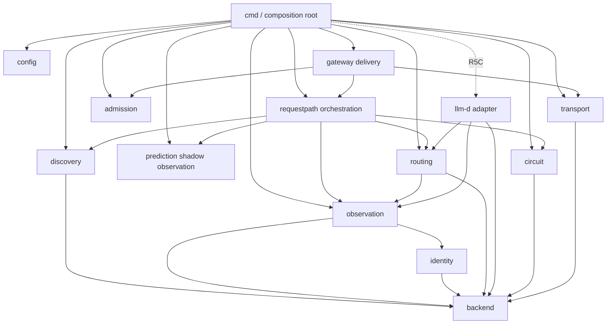

# FishMesh Serving Domain 重新设计

> 状态：R1–R4、R5A–R5C、R6A、R6B tokenization/KV cache 叶子能力已完成；R5D 顺序已由
> ADR-002 调整，下一步进入 kv-aware 纯 routing。后续变更仍必须遵守
> [`code-organization.md`](code-organization.md)，并保持每个提交可构建、可回滚。

## 1. 结论

能力域、单向依赖和简洁编排非常适合 FishMesh，但不采用附件建议的
`internal/domain/shared` 结构。

原因很简单：FishMesh 已经有 Serving、Diagnostics、Workload 三个限界上下文。把所有能力放进
顶层 `internal/domain` 会丢失上下文；把 Backend、Snapshot、Decision 和 Sample 全放进
`shared`，则只是把当前 `routing` 类型仓库换了一个名字。

目标结构保留 `internal/serving` 作为上下文，每个子包拥有一种能力和自己的类型。最上层
`requestpath` 负责选择流程，`gateway` 只负责 HTTP/SSE 交付，`cmd` 负责创建并注入实现。

## 2. 重构前问题的准确判断

R0 调研时 Go import 没有环；Go 编译器本身禁止 import cycle。实际问题是依赖中心与职责混合：

```text
gateway -> endpoint ------> routing
        -> identity ------> routing
        -> observation ---> endpoint + routing
        -> transport -----> routing
        -> routing
```

`routing` 被所有包依赖，不是因为所有包都需要路由策略，而是它同时拥有 Backend、Identity、
Observation、Sample 和 Snapshot。与此同时，它又实现 hash、load-balanced、session-key 和
circuit。类型所有权和行为所有权混在一起。

更大的问题在 `gateway/server.go`：当前 651 行同时完成：

- 创建 Kubernetes client、resolver、collector、strategy、circuit、transport；
- HTTP health/readiness/metrics/v1 delivery；
- admission、routing、fallback、in-flight lease；
- endpoint membership reconcile 和跨能力 GC；
- upstream request、SSE copy、取消、错误归类；
- metrics 和结构化日志。

这使 `cmd/fishmesh-gateway` 不是实际组合根，`gateway.NewServer` 才是隐藏的组合根，也使主请求
流程难以只看步骤理解。

## 3. 目标包结构

```text
internal/serving/
├── backend/                 # 最原子的 backend 身份与地址值对象
│   ├── backend.go
│   └── backend_test.go
├── discovery/               # backend membership snapshot
│   ├── discovery.go
│   ├── static_impl.go
│   ├── endpointslice_impl.go
│   └── *_test.go
├── identity/                # backend -> Kubernetes workload identity
│   ├── identity.go
│   ├── kubernetes_impl.go
│   └── *_test.go
├── observation/             # per-backend signals and freshness
│   ├── observation.go
│   ├── observation_impl.go
│   ├── prometheus_impl.go
│   └── *_test.go
├── routing/                 # pure endpoint-selection policies
│   ├── routing.go
│   ├── load_balanced_impl.go
│   ├── session_key_impl.go
│   ├── kv_aware_impl.go
│   └── *_test.go
├── circuit/                 # per-backend local outcome circuit
│   ├── circuit.go
│   ├── circuit_impl.go
│   └── circuit_test.go
├── admission/               # non-blocking process admission permits
│   ├── admission.go
│   ├── admission_impl.go
│   └── admission_test.go
├── transport/               # bounded HTTP client/connection ownership
│   ├── transport.go
│   ├── transport_impl.go
│   └── transport_test.go
├── requestpath/             # standalone selection and lease orchestration
│   ├── requestpath.go
│   ├── requestpath_impl.go
│   ├── requestpath_state_impl.go
│   └── requestpath_test.go
├── llmd/                    # llm-d scorer adapter（R5C 已完成）
│   ├── llmd.go
│   ├── scorer_impl.go
│   ├── translation_impl.go
│   └── *_test.go
├── gateway/                 # standalone HTTP/SSE delivery adapter
│   ├── gateway.go
│   ├── gateway_impl.go
│   ├── proxy_impl.go
│   ├── metrics_impl.go
│   └── *_test.go
└── config/                  # environment -> validated domain configs
    ├── config.go
    ├── environment_impl.go
    └── config_test.go

cmd/fishmesh-gateway/        # standalone 组合根
cmd/fishmesh-epp/            # integrated 组合根（R5C 已完成）
```

`diagnostics` 已冻结，不为了目录对称做无收益搬迁；以后发生真实修改时遵守同一文件布局。
`workload/loadgen` 是独立客户端，不 import Serving 内部包。

## 4. 每个 domain 提供什么能力

| Domain | 拥有的数据/状态 | 对外能力 | 不负责 |
| --- | --- | --- | --- |
| `backend` | `ID`、地址、稳定 metadata | 构造和校验 backend 值对象 | discovery、HTTP client、观测 |
| `discovery` | membership snapshot、resource version、freshness | `Resolver.Snapshot/Status/Close` | 负载、路由、fallback |
| `identity` | Pod/Node/声明资源映射结果 | `Provider.Resolve` | 实时 GPU score、调度 |
| `observation` | `Sample[T]`、backend signals、采集 freshness | `Reader.Snapshot/Close`、collector contract | endpoint eligibility、综合评分 |
| `routing` | mode、reason、冻结的 session-key registry | `Strategy.Select`、兼容策略 reconcile | Kubernetes、HTTP、circuit、fallback |
| `circuit` | outcome EWMA、open-until、sample count | `Record/State/Reconcile` | HTTP 状态解释、选择策略 |
| `admission` | 进程内 permit 数量 | `TryAcquire`，返回幂等 permit | 排队、tenant rate limit |
| `transport` | 每 backend HTTP client/connection pool | `Client/Remove/Close` | backend 选择、retry 策略 |
| `requestpath` | membership 对齐、local in-flight lease、selection lifecycle | `Select`、`Complete`、`Reconcile` | HTTP header、SSE copy、环境变量 |
| `llmd` | llm-d request/endpoint 到 routing 输入的翻译 | plugin 注册与 Filter/Scorer | ext_proc、discovery、flow control、proxy |
| `gateway` | HTTP handler 生命周期、response writer、Gateway metrics | health/ready/metrics/v1 handler | 创建具体 domain 实现、策略算法 |
| `config` | 环境变量到各 domain config 的映射 | `LoadEnvironment/Validate` | 运行时状态和外部网络 I/O |

### 4.1 类型所有权

当前 `routing` 类型拆分为：

```text
routing.Backend             -> backend.Backend
routing.BackendIdentity     -> identity.Identity
routing.ObservationStatus   -> discovery.Status / identity.Status / observation.Status
routing.Sample[T]           -> observation.Sample[T]
routing.BackendObservation  -> observation.Backend
routing.Snapshot            -> routing.Snapshot
routing.Decision            -> routing.Decision
routing.CircuitRegistry     -> circuit.Breaker
```

`routing.Snapshot` 可以引用 `backend.Backend` 和 `observation.Backend`，因为 routing 的职责就是
解释这些输入。当前一个 `ObservationStatus` 被 discovery、identity 和 observation 同时借用，
迁移后每个 domain 拥有自己的 typed status，避免名字相同但语义不同的状态继续耦合。反方向
依赖禁止，因此不需要 shared package。

## 5. 目标依赖 DAG



额外约束：

- `backend` 不 import 任何 FishMesh 包；
- `routing` 只依赖 backend/observation 和标准库；
- `prediction` 只依赖 backend 和标准库，拥有纯 static estimator 与 learned-shadow tracker；它不直接
  调用 routing，requestpath 只投影不可变 estimate；
- `requestpath` 不依赖 HTTP、Prometheus DTO 或 Kubernetes wire type；
- `requestpath` 可以依赖 prediction，因为它是 prediction 观测结果的编排投影点；
- `gateway` 不 import Kubernetes platform client；
- `transport` 不 import routing；
- `discovery/identity/observation` 不 import requestpath 或 gateway；
- llm-d adapter 只依赖 routing 及其稳定值对象，不依赖 standalone requestpath/gateway/transport。
  requestpath 的 discovery、observation、circuit、fallback 和 lease 在 llm-d 中已有不同 owner，
  不能形成第二套事实源。

## 6. 目标请求流程

### 6.1 RequestPath 只做调度编排

```go
func (s *service) Select(ctx context.Context, request Request) (Lease, error) {
	// 1. 构建后端、观测和本地状态快照。
	snapshot, err := s.snapshot.Build(ctx)
	if err != nil {
		return Lease{}, err
	}

	// 2. 应用 discovery/circuit eligibility 和显式 fallback。
	input := s.eligibility.Apply(snapshot)

	// 3. 执行纯路由策略并登记后端 lease。
	decision, err := s.router.Select(request.RoutingKey, input)
	if err != nil {
		return Lease{}, err
	}
	return s.leases.Acquire(decision), nil
}
```

`Lease.Complete(outcome)` 必须幂等，并负责释放 local in-flight、记录真实 transport outcome。
client cancellation、deadline、upstream disconnect、downstream disconnect 和 HTTP response 必须是
不同的 typed outcome。

### 6.2 Gateway 只做 HTTP/SSE 编排

```go
func (s *server) proxy(writer http.ResponseWriter, request *http.Request) {
	// 1. 校验请求并尝试获取 admission permit。
	permit, err := s.admission.TryAcquire()
	if err != nil {
		s.writeError(writer, request, err)
		return
	}
	defer permit.Release()

	// 2. 选择后端并建立 upstream 请求。
	lease, err := s.requestPath.Select(request.Context(), requestContext(request))
	if err != nil {
		s.writeError(writer, request, err)
		return
	}

	// 3. 转发并流式复制响应。
	outcome := s.proxy.Stream(writer, request, lease.Backend())
	lease.Complete(outcome)
}
```

`Stream` 必须把建立连接前错误、响应头后断流和 downstream cancellation 都收敛成 typed outcome，
因此主函数始终能完成 lease。header 清理、URL 拼接、SSE detector 和 copy loop 属于
`proxy_impl.go`，不再打断主流程。

## 7. 配置重新设计

R4 之前 `gateway.Config` 有 30 个字段，并被 `NewServer` 用于构造所有能力。现已改为：

```go
type Config struct {
	Gateway     gateway.Config
	Discovery   discovery.Config
	Observation observation.Config
	Routing     routing.Config
	Circuit     circuit.Config
	Admission   admission.Config
	Transport   transport.Config
	RequestPath requestpath.Config
}
```

环境变量字符串只存在于 `config/environment_impl.go`；所有 standalone Serving 的产品默认值由
`config.DefaultConfig()` 集中声明，domain 只拥有自己的 Config 类型、校验规则和运行时依赖。
组合根先加载总配置，再将小配置分别传给构造函数；环境变量只覆盖中央默认值。这样不会把 routing
阈值传给 HTTP handler，也不会让 transport 知道 EndpointSlice 配置，更不会因为某个 domain 的
构造函数偷偷补值而产生第二套运行契约。

## 8. 迁移顺序

迁移采用“先叶子、后编排”，不做一次性大爆炸重构。

### R0：规范与设计（本阶段）

- 固化本文和代码组织规范；
- 记录当前真实 DAG、目标 DAG 和映射；
- 不改变运行行为，不重启集群。

### R1：拆出核心类型与纯策略（已完成）

- 新建 `backend`，迁移 Backend；
- observation 拥有 Sample/Observation，routing 只拥有 Snapshot/Decision/Strategy；
- circuit 从 routing 拆出；
- routing mode/reason/policy 改为 typed constants；
- 添加 import architecture test 的第一版。

### R2：整理原子 I/O 能力（已完成）

- endpoint 更名为 discovery，按契约/实现文件拆分；
- identity、observation、transport 按统一文件角色整理；
- transport 不再 import routing；
- 迁移环境变量、header、metric label 等协议字面量。

### R3：提取 RequestPath 编排（已完成）

- 把 route、eligibility、fallback、in-flight lease、circuit outcome 和 membership reconcile 从
  Gateway 提取到 requestpath；
- endpoint removal 仍以一个编排事务清理各 domain 状态；
- 现有 fault/race tests 迁为 requestpath contract tests，不改变对外 header/reason。

### R4：瘦身 Gateway 与组合根（已完成）

- HTTP/SSE delivery、proxy stream、metrics 分文件；
- `cmd/fishmesh-gateway` 显式创建实现并注入；
- Gateway 不再创建 Kubernetes client、resolver、strategy 或 collector；
- 将总 Config 拆为各 domain Config。

### R5：为 P2 建立复用边界

- controlled simulator 只实现标准 discovery/observation/upstream fault contract（R5A 已完成）；
- EPP/llm-d adapter 只依赖 routing；
- standalone 与 integrated adapter 对相同候选和负载输入运行 selection/reason conformance；
- 两种运行时的 fallback、retry 和 stream lifecycle 分别按各自协议测试。

R5C 完成后，项目根据 [`ADR-002`](decisions/002-lite-kv-aware-routing.md) 重新评估交付物：
`fishmesh-epp` 继续作为 Standard mode，但不再把 Lite Gateway 降为仅开发载体。原计划 R5D 的
完整标准部署后移到 R6E，先用真实集群闭环 Lite KV-aware 主能力。

每个 R 阶段单独更新阶段文档、提交和推送。禁止在纯搬包提交中顺便改变 route reason、fallback、
timeout、连接复用或 circuit 算法。

## 9. 不采用的方案

### 不建立 `internal/domain`

它会把 Serving、Diagnostics、Workload 三个上下文混在一起。上下文比“所有 domain 放一个目录”
更重要。

### 不建立 `domain/shared`

shared 没有业务所有权，通常只会持续吸收类型。当前 routing 过载正是这种问题的实例。

这不禁止在最近共同 owner 下建立纯 `entity/<concept>` 子包。若一个较大 domain 的多个子能力，
或同一 Serving Context 内多个 domain，确实共享稳定、无外部依赖的数据模型，可以使用例如
`internal/serving/kvcache/entity/conf` 或 `internal/serving/entity/conf` 的路径；模型可以提供
`Validate`、`Equal` 等只依赖自身字段的行为。实体子包必须只依赖标准库、按具体概念命名，
不能执行 I/O 或成为所有 Config/DTO 的收容目录。单一实现专属配置仍留在自己的 owner 中。

### 不要求每包固定一个接口和一个实现

Backend 值对象不需要 `BackendService` 接口；只为目录对称创建接口会增加跳转和 mock。需要替换
的外部能力与多实现策略仍严格接口先行。

### 暂不重构 Diagnostics

它已冻结且不在请求路径。为了视觉统一搬动稳定代码没有工程收益，还会扩大 review 和回归面。

## 10. 验收标准

完成 R4 后必须达到：

- 第一次阅读每个包时，先读同包名文件即可知道契约；
- `go list` 展示的 import 符合第 5 节 DAG；
- `gateway` 不再 import Kubernetes platform、EndpointSlice DTO 或 Prometheus parser；
- `routing` 不再拥有 Backend/Observation/Circuit；
- `transport` 不再依赖 routing；
- Gateway 主代理函数和 RequestPath 主选择函数都能在约 40 行内读懂；
- 所有现有 race/fault/K3s smoke 行为保持不变；
- simulator 和未来 EPP adapter 不需要 import standalone Gateway。

## 11. R6 增量设计：KV-aware 能力域

R6 不推翻 R1–R4 的 owner 和依赖方向，只增加两个有真实替换边界的叶子能力：

```text
tokenization -> KV-aware prompt Token IDs
kvcache      -> per-backend cached-prefix snapshot
```

计划依赖为：

```text
tokenization -> standard library（vLLM Render 类型只在 adapter）
kvcache      -> backend（llm-d-kv-cache/vLLM event 类型只在 adapter）
routing      -> backend + observation + kvcache values
prediction   -> backend
requestpath  -> discovery + observation + prediction + tokenization + kvcache + routing + circuit
llmd         -> backend + observation + kvcache values + routing
gateway      -> admission + requestpath + transport
```

### 11.1 先 spike，后建包

R6A 已用最小真实集群 spike 验证 vLLM 0.23.0 KVEvents、Render API、跨 session system prompt、
eviction、Pod restart 和 stale/replay。门禁记录见阶段 18；实验探针不进入产品依赖。R6B 现在按
契约和叶子能力顺序建立生产实现，仍禁止模拟 KV event 框架或共享存储。

### 11.2 生产实现顺序

R6B 严格按叶子到编排实施：

1. `tokenization` contract/value/test；
2. vLLM Render adapter；
3. `kvcache` contract/value/test；
4. KVEvents/index/lifecycle adapter；
5. routing kv-aware 纯策略；
6. requestpath 降级编排；
7. Gateway bounded body 与原始 body replay；
8. llmd `PrefixCacheMatchInfo` 翻译。

每步独立提交，禁止把新包移动、策略行为、第三方升级和部署变更混在一起。

### 11.3 编排阅读目标

R6 后 requestpath 主函数只表达：tokenize、snapshot、eligibility/route、acquire lease。Gateway
主函数只表达：admission、bounded body、select、stream、complete。JSON、ZMQ、block hash、event
replay、map GC 和 Prometheus wire parsing 必须留在各自 adapter/owner 中。

### 11.4 状态所有权

- token IDs 随单次请求存在，完成选择后只保留转发所需 body，不进入全局 metric label；
- KV block index 由 kvcache owner 持有，有容量、Pod UID、freshness、Close 和逐 endpoint GC；
- routing 只读取不可变 `Match`，不修改 index；
- requestpath 只决定降级，不自行启动备用 subscriber；
- Standard llmd adapter 读取上游 match，不创建 Lite index；
- 多 Gateway 副本各自维护本地索引，MVP 不引入 Redis。

### 11.5 低优先级模块

Diagnostics 不因新方向重构；simulator 不模拟产品尚未证明的 KV 能力；loadgen 仍是独立客户端。
R6C 将三者从默认 release image 和部署移除，但源代码的物理删除必须单独决策。
