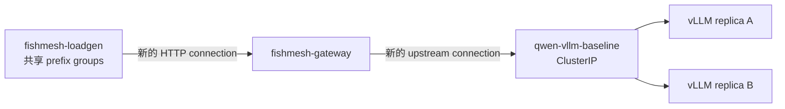

# Random-Service 基线

## 目标

在实现 prefix-aware placement 之前，先建立一个可重复的对照组。每个请求都会新建
client-to-Gateway 和 Gateway-to-upstream connection。Kubernetes 通过普通 ClusterIP
Service 选择 endpoint；Gateway 不解析 prefix，也不根据 prefix 做选路。



## 技术栈

- **Go 1.26**：Gateway 和 load generator 共用一个静态链接、可交叉编译的镜像；使用
  标准库 HTTP streaming，避免框架带来的缓冲行为。
- **vLLM 0.11 + Qwen2.5-0.5B**：这是 2026-08-06 历史数据使用的固定运行时。新实验
  基线已升级到 vLLM 0.23；历史结果不会跨版本直接比较。
- **Prometheus exposition format**：Gateway 直接暴露可抓取指标，第一轮实验不依赖
  Prometheus 服务本身。
- **Kustomize**：`kubectl` 原生支持，适合当前双节点实验环境；在实验尚未稳定前，
  Helm 或 GitOps 会增加不必要的运行面。
- **GitHub Actions + act**：GitHub workflow 是权威 CI，`act` 在本机复用同一 workflow；
  暂不维护常驻 self-hosted runner。

## 测量约定

Load generator 为每个请求输出一条 JSONL 记录，最后输出一条 summary。每条请求记录
确定性的 `prefix_group`、从 SHA-256 派生的 `prefix_key`、状态码、端到端耗时和客户端
观测的 TTFT（第一个非终止 SSE event）。Gateway 同时输出 request、upstream-error、
duration 和 first-SSE-event 指标。

只有满足以下条件，baseline 才有效：

1. 两个 vLLM replica 都是 Ready；
2. `qwen-vllm-baseline` ClusterIP Service 拥有两个 Ready Endpoint；
3. Gateway 对 upstream 开启 `DisableKeepAlives`；
4. 模型、请求数、并发数、prefix group 数、prefix 大小和生成上限均固定并记录在 JSONL 中。

## 运行手册

从 Mac 执行，并确保两个 vLLM Pod 已经 Ready：

```bash
make ci
make image                         # 构建 linux/amd64，并导入 fishmesh-gpu
kubectl --kubeconfig ~/.kube/fishmesh.yaml apply -k deploy/baseline/base
kubectl --kubeconfig ~/.kube/fishmesh.yaml rollout status deployment/fishmesh-gateway -n kubellm --timeout=3m
kubectl --kubeconfig ~/.kube/fishmesh.yaml apply -f deploy/baseline/jobs/random-service-baseline.yaml
kubectl --kubeconfig ~/.kube/fishmesh.yaml logs -n kubellm job/fishmesh-random-service-baseline > artifacts/random-service-baseline.jsonl
```

Job 有意设计成一次性的不可变实验记录。重复实验时，等待 TTL 清理，或只删除这个精确
的已完成 Job 后再次 apply。

## 第一次已验证运行

2026-08-06，Job 使用两个 Ready vLLM Endpoint、8 个 prefix groups、4096 字节共享
prefix、并发 4 和 32-token 生成上限，200 个请求全部成功。客户端观测 TTFT 为：

- P50：**77.26 ms**
- P95：**122.01 ms**
- P99：**312.67 ms**

Gateway 对应记录了 200 个 first-SSE-event 样本。完整 JSONL 证据在 Job 的一小时 TTL
内可通过运行手册命令导出；当前也已归档到本地 `artifacts/`。

## Baseline 验收前暂不实现

- Prefix registry/controller 和 cache-hit feedback；
- 根据 `X-FishMesh-Session-Key` 进行 Gateway endpoint selection；
- eBPF socket marking 与 connect-hook rewrite；该方向现已移出 MVP，除非跨节点实验先证明
  网络是主要瓶颈；
- policy-capable CNI。当前 Flannel 不能执行 NetworkPolicy，因此清单只是声明式准备，
  尚未应用。
