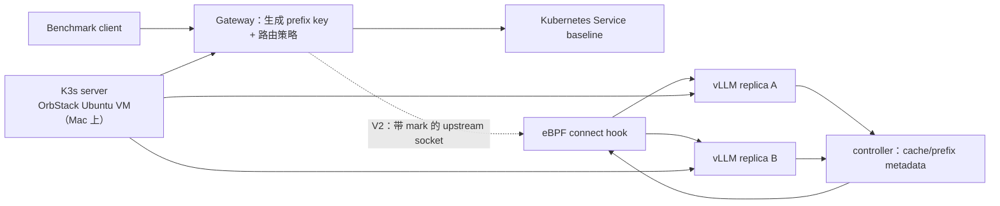

# KubeLLM-Edge：可行性与执行方案

## 决策记录

### 集群拓扑

不要把远程 K3s agent 接入 OrbStack 内置的 Kubernetes 集群。OrbStack 内置集群是
单节点开发集群，不是受支持的多节点 K3s control plane。实际方案是在 Mac 上已经
存在的 ARM64 Ubuntu VM 内运行官方 K3s server。这样既保留 Mac 托管 control plane
的目标，也得到可复现、受支持的 K3s 拓扑。

control-plane VM 和 Ubuntu GPU 笔记本加入同一个 Tailscale tailnet。GPU 笔记本通过
`K3S_URL=https://<control-plane-tailnet-ip>:6443` 加入该 server。



## 推理引擎选型

本实验选择 **vLLM**，不选择 llama.cpp。vLLM 的 Automatic Prefix Caching 正是本项目
要测量的底层机制：当新请求拥有已经出现过的共享前缀时，vLLM 可以复用 KV cache。
这样实验变量可以清晰地限定为“跨副本的请求放置策略”，而不是重新比较推理引擎。

初始工作负载：

- 模型：`Qwen/Qwen2.5-0.5B-Instruct`；
- 副本数：2；
- 每个副本的 GPU memory target：`0.35`，之后根据真实显存调整；
- 较长的共享 system prefix、较短的生成结果；
- baseline 中每次请求使用新的 upstream connection，避免 HTTP keep-alive 产生意外的连接亲和性。

已验证 GPU 为 NVIDIA GeForce RTX 4060 Laptop GPU，显存 8188 MiB，驱动
590.48.01，CUDA 13.1，compute capability 8.9。因此初始双副本配置每个副本使用
`0.35` GPU memory utilization，最大上下文长度为 4096。只有当两个副本稳定运行后，
才可以讨论双副本的 cache-locality 结果。

## eBPF 范围修正

eBPF 不应解析任意 prompt JSON、TLS 或通用 HTTP 流。HTTP header 可能被加密、压缩，
也可能跨多个 TCP segment，这类设计脆弱且难以维护。

项目分为两个阶段：

1. **V1：正确性与实验阶段。** Gateway 在用户态解释请求，生成稳定的 prefix key，
   查询 controller 维护的 `prefix -> endpoint` registry，并在用户态选择 vLLM endpoint。
   这一阶段先证明或否定核心假设。
2. **V2：eBPF data plane。** 特权 DaemonSet 维护从具备碰撞管理的 32-bit route ID
   到 endpoint IP/port 的 pinned eBPF map。Gateway 在新建 upstream socket 上设置
   `SO_MARK`；cgroup `connect4/connect6` BPF 程序只改写带 mark 的 inference Service
   连接到指定 endpoint，不检查请求内容。连接复用需要关闭，或按 route ID 分区。map
   controller、hit/miss 计数器以及 Pod 重启时回退到 Service 的安全路径都属于交付内容。

这样既保留真实的 eBPF 工作，又保持清晰的信任边界：只有 Gateway 解读 prompt，内核
只接收不透明的 route ID。

## 网络与调度配置

- K3s server 和 agent 使用相同的固定版本。
- Flannel 使用 `tailscale0` 作为节点接口。Tailscale 承载 API、kubelet、VXLAN 和
  Pod-to-Pod 流量，不暴露公网端口。
- GPU agent 标记为 `kubellm.io/gpu=true`，并设置污点
  `kubellm.io/gpu=true:NoSchedule`；GPU 工作负载带对应的 toleration 和 node selector。
- 在 K3s agent 前安装 NVIDIA Container Toolkit，使 K3s 能识别 `nvidia` runtime；
  然后安装带双路 time-slicing 配置的 NVIDIA device plugin。
- Gateway 阶段需要增加 default-deny NetworkPolicy，只允许 DNS 和 Gateway-to-inference
  流量，并使用专用 ServiceAccount。这些控制目前还没有部署到 bootstrap 阶段的
  `kubellm` namespace。当前推理容器已经使用禁止提权的 security context、资源限制和健康检查。

## 执行门槛

| 门槛 | 所需证据 | 状态 |
| --- | --- | --- |
| Control-plane connectivity | `fishmesh-control-plane` 在 `100.111.18.52` Ready | 已通过 |
| GPU 主机健康 | RTX 4060、8188 MiB、驱动 590.48.01、CUDA 13.1、剩余 123 GiB 存储 | 已通过 |
| Agent 加入集群 | `fishmesh-gpu` 在 `100.98.49.106` Ready | 已通过 |
| Pod 使用 GPU | CUDA Job 返回 RTX 4060、驱动 590.48.01 和 8188 MiB | 已通过 |
| GPU sharing | device plugin 通过 time-slicing 发布 `nvidia.com/gpu: 2` | 已通过 |
| 双副本稳定 | 两个 vLLM Pod Ready、两个 Endpoint、真实 Chat Completion 已验证 | 已通过 |
| Baseline 实验 | 可重复的 random-Service 结果与 TTFT 分位数 | 已通过 |
| Prefix policy | warmed-prefix 降低 TTFT，并报告 placement/cache 计数器 | 待完成 |
| eBPF V2 | Pod 重启时 BPF map steering 与 fallback 路径验证 | 待完成 |

## 已安装运行时与约束

- control plane 在现有 OrbStack `ubuntu` VM 内运行 `v1.36.3+k3s1`。本地 kubeconfig
  位于仓库外的 `~/.kube/fishmesh.yaml`，包含凭据，绝不能提交到 Git。
- GPU 笔记本使用独立的 `k3s-fishmesh-agent` 服务，数据位于
  `/var/lib/rancher/fishmesh-agent`，kubelet root 位于 `/var/lib/kubelet-fishmesh`。
  之前的 `k3s.service` 及 `/var/lib/rancher/k3s` 数据已保留。运行当前隔离 agent 时必须
  保持旧服务 disabled，否则会争用 kubelet 和网络资源。
- Ubuntu 直接连接 Docker Hub 或 `registry.k8s.io` 使用的 Google Artifact Registry redirect
  不稳定。`k3s-fishmesh-agent` 的 systemd override 持久使用本地 Clash HTTP proxy
  `127.0.0.1:7890`，并将 tailnet 与集群 CIDR 放入 `NO_PROXY`，因此 containerd 可以正常拉取
  Docker Hub 镜像。sandbox image 固定为 `mcr.microsoft.com/oss/kubernetes/pause:3.10`，
  Pod 创建不依赖该代理。NVIDIA NGC 和 `hf-mirror.com` 可以直接访问。
- OrbStack 会向 VM service 注入 HTTP proxy。K3s service 已配置 Tailscale 与 Kubernetes
  Pod/Service CIDR 的 `NO_PROXY`，API-server 到 kubelet 的 logs/exec 不经过代理。

从 Mac 使用集群：

```bash
kubectl --kubeconfig ~/.kube/fishmesh.yaml get nodes
```

## vLLM 部署与验收

固定的 `docker.io/vllm/vllm-openai:v0.11.0` 镜像必须提前存在于 GPU agent 的 containerd
中。这样临时 registry 故障不会改变工作负载启动行为；清单明确设置了
`imagePullPolicy: Never`。

`Qwen2.5-0.5B-Instruct` 只在 GPU 主机预加载一次，位置为
`/var/lib/fishmesh/models/Qwen2.5-0.5B-Instruct`，大小约 954 MiB。清单中的 local PV
通过 PVC 以只读方式暴露该目录，而不是给应用直接授予 `hostPath`。PV 有意绑定到
`fishmesh-gpu`；如果 Kubernetes 节点名变化，需要同步调整。

```bash
# 在镜像和本地模型都已预加载到 fishmesh-gpu 后，从 Mac 执行。
kubectl --kubeconfig ~/.kube/fishmesh.yaml apply \
  -f deploy/system/qwen-model-cache-pv.yaml
kubectl --kubeconfig ~/.kube/fishmesh.yaml apply -f deploy/inference/vllm-qwen.yaml
kubectl --kubeconfig ~/.kube/fishmesh.yaml rollout status deployment/qwen-vllm \
  -n kubellm --timeout=15m
kubectl --kubeconfig ~/.kube/fishmesh.yaml apply \
  -f deploy/validation/vllm-api-smoke-test.yaml
kubectl --kubeconfig ~/.kube/fishmesh.yaml logs job/vllm-api-smoke-test -n kubellm
```

两个副本各请求一个 time-sliced GPU share。已验证的稳态显存使用约为 6870 / 8188 MiB，
剩余约 1.3 GiB。这是实验级配置，不是生产级 GPU 隔离：time-slicing 不提供 VRAM 隔离，
因此必须保守设置 vLLM memory target 和上下文长度。

在 vLLM 0.11 中必须使用 `--model /models/...` 传入本地路径；位置参数只会记录为
`model_tag`，可能导致引擎继续使用镜像默认模型。

## 可复现的只读 GPU preflight

在仓库根目录执行：

```bash
ssh ubuntu 'bash -s' < scripts/ubuntu-preflight.sh
```

该脚本只读检查，不会安装、重启或修改任何内容。
