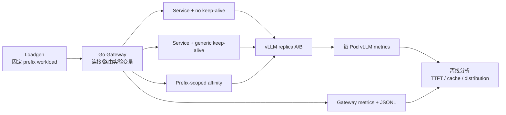

# `plan.md` 可行性评审与重构方案

评审日期：2026-08-08

## 一句话结论

`plan.md` 的问题意识是成立的：LLM Serving 的 KV cache 具有状态，普通 Kubernetes
Service 不理解这些状态。但当前计划把四个独立项目叠在一起：eBPF observability、
Prefix routing、流量 shadowing 和 AIOps。作为秋招项目，它会显得目标过宽、验证链条
过长，而且 eBPF 在核心路径上是人为增加的技术难点。

新的主线应改成：

> **在 Kubernetes LLM Serving 中，比较普通 Service、TCP connection affinity 和
> prefix-aware endpoint routing，判断语义路由相对于连接复用是否带来可测量收益。**

这个问题更真实，也直接回应了“TCP 长连接可能已经足够”的反对意见。最终结果可以是
“prefix-aware routing 有显著收益”，也可以是“连接亲和性已经足够”；两种结论都具有
工程价值。

## 1. 对原计划的总评

### 仍然成立的核心假设

LLM 请求不是完全无状态的。共享 system prompt、知识库上下文和 conversation prefix
会影响 prefill 工作量与 KV cache 复用。请求落到不同 vLLM replica 时，各进程的本地
KV cache 不能自动互相复用，因此“请求放置”是一个合理的研究变量。

但必须把三个概念分开：

1. **请求路由（request routing）**：Gateway 决定一次请求发给哪个已存在的 inference
   worker；这是当前项目应该做的核心。
2. **Kubernetes 调度（Pod scheduling）**：决定 Pod 应该运行在哪个 Node；不应该为了
   这个实验修改 Kubernetes scheduler。
3. **网络数据面（network dataplane）**：在连接建立后改写 socket；它是可选优化，不是
   证明 KV cache locality 所必需的前置条件。

原计划把这三个层面混成了“state-aware scheduling”，导致实现边界失真。

### 原计划最严重的问题

| 原模块 | 可行性判断 | 新方案处理 |
| --- | --- | --- |
| eBPF LLM Observability | eBPF 可以测 TCP RTT、重传和连接生命周期，但不能可靠知道 token、KV hit 或 prefix 语义 | 核心观测改为 Gateway + vLLM `/metrics`；eBPF 只作为可选网络诊断实验 |
| State-aware LLM Scheduling | Prefix 到 worker 的请求路由可行；改 Kubernetes scheduler 或做 CRD Operator 不是 MVP 必需 | 改名为 `prefix-aware request routing`，先做 Gateway 内部路由 |
| eBPF Traffic Shadowing | 对 streaming/SSE 请求做内核级复制无法安全地完成独立 replay，响应、背压和副作用都难处理 | 从核心范围删除；将来用 Gateway 应用层 replay 做模型灰度 |
| LLM Infra AIOps Agent | 需要完整的时序数据、故障样本和诊断评估，和路由实验是另一条产品线 | 从 MVP 删除，作为后续展示或附录 |

因此，原计划不是“不能做”，而是必须从平台型宏大叙事收敛成一个可证伪的实验问题。

## 2. 当前项目哪些部分可以复用

| 现有部分 | 复用结论 | 需要的调整 |
| --- | --- | --- |
| Mac OrbStack VM + Ubuntu GPU 节点 + Tailscale K3s | **全部复用** | 它是稳定的实验基础设施，不再扩展 control plane |
| NVIDIA Toolkit、device plugin、time-slicing | **全部复用** | 记录其“同一张 8 GiB GPU 上的两个进程”这一实验限制 |
| vLLM 0.11 + 本地 Qwen2.5-0.5B + PV/PVC | **全部复用** | Phase 1 继续使用 0.5B，不要立刻换成 `Qwen2.5-1.5B` |
| Gateway Go 进程、OpenAI streaming proxy、TTFT 指标 | **大部分复用** | 把 routing 抽象成接口，补充 keep-alive、endpoint 和失败回退测试 |
| Loadgen、prefix groups、JSONL、TTFT 分位数 | **大部分复用** | 记录 token 数、route mode、connection reuse；不要把原始字符串 hash 宣称为 vLLM cache key |
| `qwen-vllm-baseline` ClusterIP Service | **复用** | 作为真正的 random-Service 对照组 |
| headless `qwen-vllm` Service | **复用** | 仅在需要直接访问具体 Pod endpoint 时使用 |
| Kustomize、资源限制、健康检查、ServiceAccount、CI | **复用** | 继续保持；不要为了实验引入 Helm/Operator |
| eBPF、CRD、Operator、AIOps、shadow traffic | **暂不复用** | 从核心 MVP 移出，避免形成无法验收的第二条项目线 |

当前仓库中的 connection-matrix 改动很有价值，因为它已经开始验证“keep-alive 是否
足够”。但它应被视为实验分支，而不是最终架构。

## 3. 当前 connection-matrix 代码需要重构的地方

### 3.1 静态 Pod IP 不能成为正式方案

`gateway-prefix-hash-keepalive.yaml` 使用了某一时刻的 Pod IP 快照。Pod 重建、滚动
更新或节点故障后，IP 就会失效。这可以作为一次性实验快照，但不能作为工业级路由实现。

正式实现有两个选择，按优先级排列：

1. **先不直连 Pod IP**：只测试 Service + per-prefix connection affinity；这是最小权限、
   最贴近普通 Kubernetes 的方案。
2. **确实需要语义路由时**：Gateway 使用 `client-go` watch `EndpointSlice`，只选择 Ready
   endpoint，并在 endpoint 变化时清理失效连接。不要把 IP 写进 ConfigMap。

### 3.2 “开启 keep-alive”不等于“prefix 亲和”

当前 `service-keepalive` 使用一个普通 Go `http.Transport`。它会复用连接，但不同 prefix
可能共享同一个连接池，也可能在并发时创建多条连接；因此它不能证明“同一个 prefix 始终
落到同一个 worker”。

实验必须区分三种状态：

1. **Service + no keep-alive**：每个请求新建 TCP 连接，作为随机 baseline；
2. **Service + generic keep-alive**：所有 prefix 共用 Gateway 的上游连接池，作为真实
   工程优化；
3. **Prefix-scoped connection affinity**：Gateway 为 prefix group 维护有界的连接/客户端
   分区，验证连接亲和性本身能否获得收益。

只有第三种才能直接回答“TCP 长连接是否已经足够”。同时要记录连接数、连接重建次数、
同一 prefix 的 endpoint 稳定性和并发排队时间，否则 keep-alive 造成的收益无法解释。

### 3.3 当前 prefix key 只是实验分组标识

Loadgen 当前根据原始 system prefix 字符串生成 SHA-256 key。这可以保证实验分组稳定，
但它不是 vLLM 的内部 cache key。vLLM 的 prefix caching 是基于 token block 和父 prefix
哈希构建的；原始字符串字节数也不等于 token 数。

因此需要明确命名：

- `prefix_group`：实验 workload 的分组标识；
- `routing_key`：Gateway 用于一致路由的稳定 key；
- `vllm_cache_hit`：必须来自 vLLM 自己的指标，不能由 Gateway 的 hash 推断。

后续若要实现真实 prefix-aware routing，应使用与 Qwen chat template 一致的 tokenizer，
记录实际 prompt token 数和 canonical prefix，而不是把 byte hash 直接称为 cache hash。

### 3.4 路由结果必须有真实证据

Gateway 返回 `X-FishMesh-Upstream` 只能说明 Gateway 选择了哪个配置地址；在 ClusterIP
模式下，它不知道 kube-proxy 最终选择了哪个 Pod。应使用以下证据组合：

- Gateway：route mode、routing key、连接复用/新建、请求失败和 TTFT；
- 每个 vLLM Pod 的 `/metrics`：prefix cache queries/hits、KV cache usage、running/waiting
  requests、TTFT；
- 节点：GPU utilization、显存、CPU、Pod restart；
- Loadgen：TTFT、ITL、端到端延迟、生成 token 数、错误率。

不要把 `prefix_key` 作为 Prometheus label，否则 prefix 数量增加后会造成高基数；它应留在
JSONL 或 tracing context 中。

## 4. 推荐的新架构



推荐技术选型：

- **Gateway**：继续使用 Go 标准库，不引入 web framework；新增 `RouteStrategy`、
  `EndpointResolver` 和 `ConnectionPool` 接口；
- **第一版 affinity**：优先做 prefix-scoped connection affinity，不要求 Gateway 访问
  Kubernetes API；
- **第二版 direct endpoint**：只有当第一版证明 generic keep-alive 不够时，才加入
  `client-go` + EndpointSlice watch；使用 rendezvous hashing，避免简单 modulo 在 Pod
  变化时大量迁移 prefix；
- **状态存储**：单 Gateway 副本时用进程内状态；只有多 Gateway 副本需要共享路由状态时，
  才讨论 CRD、controller 或外部存储；
- **观测**：Gateway metrics + 每 Pod vLLM `/metrics` + JSONL；不先安装 Grafana、OTel
  Collector 或 AIOps Agent；
- **模型**：继续用已经验证的 Qwen2.5-0.5B。8 GiB GPU 上双副本的主要目标是验证路由，
  不是追求大模型吞吐。

## 5. 新的实施步骤

### Phase 0：冻结问题定义与实验变量

目标是避免“边做边换问题”：

- 项目标题改为“LLM Serving 中连接亲和性与 Prefix-aware Routing”；
- 将 `plan.md` 中 eBPF、shadow、AIOps 标记为 deferred；
- 将当前未提交的 connection-matrix 代码单独整理、测试和记录；
- 固定模型、两个副本、prefix groups、token 数、并发、warm-up 和重复次数。

验收：任何一次运行都能回答“这次只改变了哪个变量”。

### Phase 1：测量正确性

- 将 workload 的 prefix 从“字节长度”改为“实际 token 数”或至少同时记录 token 数；
- 让 Loadgen 消费完整 SSE 到 `[DONE]`，并记录 TTFT、ITL、output tokens；
- 为每个 vLLM Pod 获取实验前后 `/metrics` 快照；
- 为 Gateway 增加 route mode、连接复用和 endpoint 变化的测试；
- 完成 Pod 重启后的 endpoint/连接失效测试。

验收：不用任何 prefix-aware routing，也能稳定复现同一组 TTFT 和 vLLM cache 指标。

### Phase 2：完成 connection matrix

严格按以下顺序运行，避免一上来就做复杂路由：

1. Service + no keep-alive；
2. Service + generic keep-alive；
3. Prefix-scoped connection affinity；
4. （可选）同一个 prefix group 的固定 endpoint 路由。

每个条件至少多轮运行，并记录 warm-up、请求顺序和随机种子。比较：TTFT、ITL、端到端
延迟、吞吐、错误率、连接重建数、每 Pod 请求分布和 prefix cache hit。

关键决策门：

- 如果 generic keep-alive 或 prefix-scoped affinity 已经接近固定 endpoint，项目的结论
  应是“简单连接亲和性已足够”，不要为了制造差异继续堆 eBPF；
- 如果 prefix-scoped affinity 仍然受 Service endpoint 漂移影响，再进入 EndpointSlice
  + direct endpoint routing；
- 如果 routing 改善不显著，应诚实记录 negative result，而不是引入更多复杂性掩盖它。

### Phase 3：最小 Prefix-aware Routing

只有 Phase 2 证明有必要时才做：

- Gateway watch Ready EndpointSlice；
- 为每个 endpoint 创建有界、可关闭的 HTTP client/connection pool；
- 用 routing key 做 rendezvous hashing；
- endpoint 删除或 Pod 重启时清理连接，并回退到 Service；
- 暂不创建 CRD、Operator 或 scheduler plugin；
- 记录 prefix-to-endpoint 映射和 endpoint 变更时的迁移数量。

验收：Pod 重启、滚动更新、扩缩容后，旧映射不会黑洞请求，且 fallback 有指标。

### Phase 4：形成面试级实验结论

把实验收敛为一张表：

| 条件 | 需要回答的问题 |
| --- | --- |
| Service + no keep-alive | 普通 Kubernetes Service 的随机基线是多少 |
| Service + generic keep-alive | TCP 连接复用自然带来的收益是多少 |
| Prefix-scoped affinity | 只做连接分区能否保持 prefix locality |
| Direct endpoint routing | 语义路由相对连接方案的增量收益是多少 |

最终展示内容应包括架构、实验变量、指标、失败场景和 negative result，而不是代码行数。

### Phase 5：可选扩展

只有核心结论成立后再考虑：

- 多 Gateway 副本下共享 registry；
- CRD/Operator 管理实验策略；
- 应用层 shadow/replay 做模型升级验证；
- eBPF 作为网络根因分析或 socket 级优化；
- read-only AIOps 诊断报告。

这些都是独立的后续工作，不应出现在第一版项目标题和验收标准中。

## 6. 当前应删除或暂缓的内容

### 从主线删除

- `An eBPF-powered State-aware Data Plane and AIOps Platform` 这一项目副标题；
- Module C 的 eBPF traffic shadowing；
- Module D 的 AIOps Agent；
- 任何声称 eBPF 能直接观测 KV cache hit 或解析 prompt 的描述；
- 为了展示技术栈而提前加入的 Operator、CRD、Grafana 和 OTel Collector。

### 暂缓但保留为后续章节

- eBPF TCP RTT/retransmission 诊断；
- EndpointSlice controller；
- 多 Gateway 共享 registry；
- 应用层 shadow/replay；
- read-only AIOps。

## 7. 主要风险与应对

| 风险 | 后果 | 应对 |
| --- | --- | --- |
| 2 个 vLLM Pod 共用同一张 RTX 4060 | GPU contention 混入路由结论 | 固定资源、固定并发、重复运行；不宣称生产级隔离 |
| prefix cache 被上一轮实验污染 | warm/cold 对比失真 | 每轮使用新的 `prefix_namespace`，并记录 warm-up 和指标快照 |
| raw bytes 被当成 token prefix | 路由 key 与真实 cache 行为不一致 | 记录 tokenizer 后 token 数；cache hit 只信 vLLM metrics |
| generic keep-alive 连接池混用 prefix | 错把 keep-alive 当作 affinity | 增加 prefix-scoped connection 条件，并记录连接归属 |
| 静态 Pod IP 过期 | 重启后请求 502 | EndpointSlice watch 或回退到 Service，禁止静态 IP 进入正式清单 |
| 只测 TTFT、不测 queue/cache | 无法解释结果 | 采集 Gateway + vLLM per-Pod metrics |
| 为了证明创新而强行引入 eBPF | 项目刻意、难以验收 | 把 eBPF 变为可选扩展，接受“keep-alive 已足够”的结果 |

## 8. 最终项目定位

推荐最终标题：

> **FishMesh：Kubernetes LLM Serving 中连接亲和性与 Prefix-aware Routing 的实验系统**

核心标签：

```text
LLM Serving
Kubernetes
vLLM
Request Routing
KV Cache Locality
Observability
```

eBPF 可以作为后续扩展标签，但不再是项目必须证明的中心卖点。

## 参考的 vLLM 能力边界

- [Automatic Prefix Caching](https://docs.vllm.ai/en/latest/design/prefix_caching/)
- [vLLM v0.11 Metrics](https://docs.vllm.ai/en/v0.11.0/design/metrics.html)
