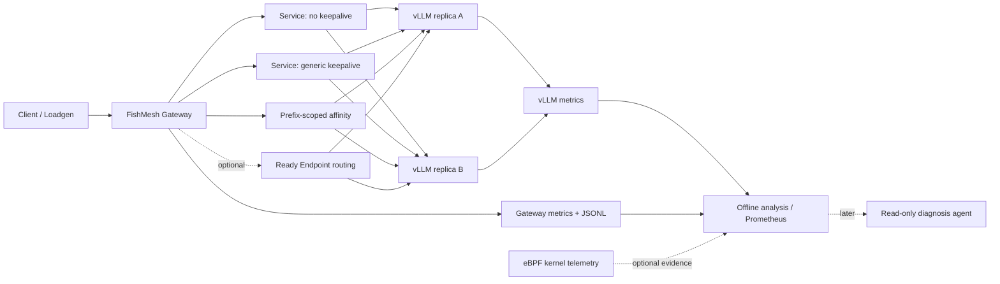

# KubeLLM-Edge V2 项目规划书

> 面向 Kubernetes LLM Serving 的智能请求路由与推理可观测平台
>
> 文档状态：V2 决策基线
>
> 适用范围：新一轮开发、实验、面试材料和项目演示

## 1. 文档定位

本文件是旧方案的隔离版重规划，不覆写 `docs/plan.md`、`docs/plan-review.md` 或此前的开发记录。旧文档保留为设计演进历史；从本文件发布后，新增代码和实验以 V2 的边界为准。

V2 接受决策意见中的核心修正：

1. eBPF 不再承担 LLM 语义识别或主路由职责，而是内核级网络事实的采集能力。
2. “State-aware Scheduling” 更名为 “Prefix-aware Request Routing”，明确这是请求到推理后端的路由，而不是 Kubernetes Pod 调度。
3. 把 Generic Keepalive、Prefix-scoped Affinity 和直接后端路由放进同一个可重复的对照实验，回答“连接复用是否已经足够”这一真实工程问题。
4. 实验中的 `prefix_group`、网关 `routing_key` 和 vLLM 内部 Prefix Cache Key 分开命名、分开测量；不再把 SHA-256 前缀哈希宣称为 KV cache key。
5. Traffic Shadowing 不进入 MVP。后续若有需求，优先采用网关层受控 replay，而非在 eBPF 中复制和解析 SSE/流式 LLM 请求。

## 2. 项目定义

### 2.1 一句话定义

KubeLLM-Edge 是一个运行在 K3s 上、面向多副本 vLLM Serving 的请求路由与可观测平台：它用可解释的 Prefix-aware Routing 研究推理状态局部性，用 vLLM 和网关指标验证效果，并在后续阶段用 eBPF 补充网络层证据。

### 2.2 核心工程问题

多个 vLLM 副本各自持有本地 GPU/KV 状态。同一类请求如果被反复分配到不同副本，可能降低 Prefix Cache 命中、增加 Prefill 工作和 TTFT；但过度固定后端又会引入负载不均、故障恢复和连接池管理成本。

本项目不预设“语义路由一定更快”，而是设计可证伪的实验，比较以下选择：

```text
Service + no keepalive
Service + generic keepalive
Prefix-scoped connection affinity
Optional direct endpoint routing
```

最终结论可以是“Prefix affinity 有收益”“收益只在特定负载出现”“Generic Keepalive 已足够”，任何结果都具有工程价值。

### 2.3 项目价值

- 对业务层：展示 LLM 请求的前缀分组、路由策略和 TTFT/吞吐影响。
- 对 Serving 层：展示 vLLM 多副本、Prefix Cache、队列和 GPU 资源之间的关系。
- 对平台层：展示 K3s、Kustomize、指标、实验配置、故障恢复和可复现交付。
- 对系统层：后续可用 eBPF 给出 RTT、重传、socket stall 等内核级证据，但不把内核观测误称为 LLM 状态理解。

## 3. V2 目标与非目标

### 3.1 MVP 必须完成

1. 在 OrbStack K3s 控制平面和 Ubuntu RTX 4060 算力节点上稳定运行 Gateway、Loadgen 和两个 vLLM 副本。
2. 建立统一的 JSONL 实验记录，记录请求级延迟、错误、前缀分组、路由模式、实际上游和响应 token 数。
3. 完成四组路由/连接对照：Service 无 Keepalive、Service Generic Keepalive、Prefix-scoped Affinity，以及条件允许时的 Direct Endpoint。
4. 同时采集网关指标、每个 vLLM Pod 的指标和 GPU/节点基础状态。
5. 输出可复核的结论：每组条件的 P50/P95/P99 TTFT、成功率、吞吐、后端分布及 Prefix Cache 相关指标。
6. 所有实验可用 Kustomize overlay 和固定参数重新运行，产生带版本、配置摘要和时间戳的 artifact。

### 3.2 明确不做

- 不实现自定义 CUDA kernel、推理引擎或 KV Cache 跨 Pod 迁移。
- 不修改 Kubernetes Scheduler，不把请求路由描述为 Pod 调度。
- 不在 eBPF 中解析 prompt、token、SSE 内容或决定后端。
- 不在 MVP 引入 CRD、Operator、数据库、服务网格或多集群控制器。
- 不把固定 Pod IP 作为正式路由发现机制。
- 不在没有安全、采样和幂等约束时做流量镜像。
- AIOps Agent 在进入只读诊断阶段前不执行扩缩容、重启、修改路由等写操作。

## 4. 总体架构



### 4.1 Application Plane

由 Gateway、Loadgen、vLLM 和分析脚本组成，负责可见的 LLM 语义与请求事实：

- Gateway 生成 request ID，识别 `prefix_group`，执行路由策略并记录实际上游。
- Loadgen 生成受控的共享前缀/变化后缀工作负载，消费完整流式响应并测量 TTFT、ITL 和 E2E。
- vLLM 提供真正的服务端指标，包括请求延迟、队列、运行请求和 Prefix Cache 指标。

### 4.2 Routing / Control Plane

MVP 只需要 Gateway 内的策略接口和配置，不创建独立 Controller。将来需要动态后端发现时，再加入 EndpointSlice resolver；它应只输出 Ready endpoint 快照，不把 Pod IP 永久写死在业务配置中。

### 4.3 Kernel / Infrastructure Plane

OrbStack K3s 负责控制平面，Ubuntu RTX 4060 负责 GPU 节点、NVIDIA device plugin 和 vLLM。Tailscale/Clash 只作为运维和镜像拉取路径，不进入实验结论。eBPF 若实现，采集 TCP RTT、重传、socket 生命周期和连接 stall，作为网络解释变量。

### 4.4 Diagnostics Plane

只读诊断层消费 Gateway、vLLM、节点和可选 eBPF 数据，先使用规则和证据链，再考虑 LLM 总结。任何自动修复都不属于 V2 的默认行为。

## 5. 可证伪的研究问题

| 编号 | 问题 | 可证伪假设 | 主要证据 |
| --- | --- | --- | --- |
| Q1 | Generic Keepalive 是否已经带来足够的后端局部性？ | H0：与无 Keepalive 相比，TTFT/Prefix Cache 无稳定改善 | 实际上游、连接复用、TTFT、cache hit |
| Q2 | Prefix-scoped affinity 是否比 Generic Keepalive 更稳定地复用同一后端？ | H1：同一 `prefix_group` 的后端分布熵下降，且 cache hit 上升 | prefix→backend 映射、每 Pod 指标 |
| Q3 | 局部性收益是否会被热点和排队抵消？ | H2：高并发或单热点前缀下，P95 可能恶化 | P95/P99、queue/running、GPU 利用率 |
| Q4 | 网络问题是否被误诊为 LLM 状态问题？ | H3：TTFT 上升时，eBPF 网络证据能区分重传/RTT 与服务端排队 | vLLM + Gateway + eBPF 时间窗口 |

若实验不支持 H1，项目仍然成功：这说明引入语义路由的复杂度在当前规模下不值得，结论本身比“预设优化有效”更可信。

## 6. 复用、重构与延后

| 现有部分 | 决策 | V2 处理 |
| --- | --- | --- |
| OrbStack K3s + Ubuntu GPU 节点 | 完全复用 | 作为固定实验拓扑，记录架构、节点和 GPU 约束 |
| NVIDIA device plugin、模型缓存、vLLM Deployment | 完全复用 | 保持小模型默认，1.5B 仅作为显存允许时的可选配置 |
| Gateway HTTP/SSE 代理 | 复用并重构 | 抽出策略、上游选择、连接池和观测接口 |
| Loadgen | 复用并补强 | 固定前缀工作负载、完整流消费、实验 metadata 和错误分类 |
| Kustomize base/overlay、Jobs、CI | 复用 | 每个条件一个 overlay/Job，配置和 artifact 可追溯 |
| Service 无 Keepalive / Generic Keepalive | 保留 | 作为两组基线，不能合并成单一“keepalive”结论 |
| 静态 Pod IP prefix hash | 仅作临时实验 | 不作为正式方案；后续用 EndpointSlice 或 Service fallback |
| Prefix hash | 改名并限义 | 只叫 `prefix_group` 或 `routing_key`，不叫 vLLM cache key |
| eBPF 语义路由 | 删除主线 | 改为后续 kernel telemetry |
| eBPF traffic shadow | 延后并改形态 | 若需要，采用 Gateway replay、采样、脱敏和幂等约束 |
| CRD/Operator | 延后 | 只有出现多 Gateway/策略生命周期需求时再引入 |
| AIOps Agent | 延后 | 先完成指标和证据契约，再做只读诊断 |

## 7. 实验设计

### 7.1 条件矩阵

| 条件 | 入口 | 后端选择 | 连接模型 | 目的 |
| --- | --- | --- | --- | --- |
| A | Gateway → Service | Service LB | 每次新连接 | 最保守基线 |
| B | Gateway → Service | Service LB | 通用 HTTP Keepalive | 测量 transport locality |
| C | Gateway | `prefix_group` 分桶 | 每桶有界连接池 | 测量 semantic/prefix locality |
| D | Gateway | Ready endpoint + 稳定哈希 | 每桶有界连接池 | 验证绕过 Service 的上限；可选 |

所有条件固定相同的模型、prompt 数量、前缀长度、并发、最大输出 token、warm-up、运行时长和随机种子。每个条件至少重复三次；首轮只做单变量比较，避免同时改变并发和连接池大小。

### 7.2 命名契约

- `prefix_group`：Loadgen 为实验构造的“共享前缀类别”，用于控制哪些请求理论上具有相同前缀。
- `routing_key`：Gateway 用于选择后端的输入，可以由 `prefix_group` 派生，但不等同于 vLLM 内部实现。
- `backend_id`：实验中实际命中的上游身份，优先使用稳定的 Deployment/endpoint 标识。
- `vLLM Prefix Cache Key`：由 vLLM 按 token block、父块和相关盐值计算的内部键，只通过 vLLM 指标验证，不由 Gateway 声称自己复现。

vLLM 的 Prefix Caching 设计和指标定义以官方文档为准：[Automatic Prefix Caching](https://docs.vllm.ai/en/latest/design/prefix_caching/) 和 [vLLM Metrics](https://docs.vllm.ai/en/v0.11.0/design/metrics.html)。

### 7.3 指标契约

请求级 JSONL 至少包含：`run_id`、`condition`、`request_id`、`prefix_group`、`routing_key`、`routing_mode`、`selected_upstream`、`start_ns`、`first_token_ns`、`end_ns`、`ttft_ms`、`e2e_ms`、`output_tokens`、`status`、`error_class`。

Gateway Prometheus 指标包含请求总数、请求延迟、上游错误、连接新建/复用和当前策略；不要把无限基数的 prompt、request ID 或原始 hash 放进 label。

每个 vLLM Pod 采集：TTFT、请求/队列/运行数、KV cache 使用、Prefix Cache queries/hits（若当前 vLLM 版本暴露）、错误和 GPU 使用。Node 侧记录 GPU 显存、温度、利用率和 OOM 事件。

## 8. 技术决策

| 领域 | V2 选择 | 原因 |
| --- | --- | --- |
| Gateway | Go 标准库 HTTP/SSE | 当前代码可复用，依赖少，便于审计和压测 |
| 路由接口 | `RouteStrategy` + `BackendResolver` | 让 Service、Prefix affinity、Endpoint routing 可替换 |
| 连接管理 | 有界 Transport/连接池 | 将 affinity 与连接数、队列效应分开测量 |
| 后端发现 | MVP 配置化；后续 EndpointSlice | 先跑通实验，避免过早引入 informer/failure handling |
| 部署 | Kustomize + Namespace/ConfigMap/Job | 与当前仓库和 K3s 现状一致、易复现 |
| 指标 | Prometheus exposition + JSONL artifact | 在线观测和离线复盘各有稳定接口 |
| 分析 | Python 3.12 + uv，标准库起步 | 低门槛解析 JSONL；绘图/统计依需求添加 |
| 推理 | vLLM 小模型默认 | RTX 4060 8 GiB 上优先确保双副本稳定；更大模型单独验证 |
| 持久化 | 不引入数据库 | MVP 使用 artifact；只有长期多轮实验才评估对象存储/时序库 |

## 9. 验收标准

### MVP 通过条件

- 两节点均 Ready，Gateway、Loadgen、vLLM 副本可重复部署和删除。
- A/B/C 三组条件均完成至少三次有效运行，D 组在后端发现实现后加入。
- 每次运行都有配置快照、镜像/代码版本、节点信息和 JSONL artifact。
- 失败请求可按连接、HTTP、SSE、推理和超时分类，不允许静默丢失。
- 报告同时展示延迟、成功率、上游分布和 vLLM 指标；不能只展示平均 TTFT。
- 在单一变量不变时重复运行的核心指标方向一致；若不一致，报告波动而不是挑选最好的一次。

### 面试级完成条件

- 能解释为什么 Generic Keepalive 不等于 Prefix Affinity。
- 能解释为什么 Gateway 的 SHA-256 不是 vLLM Cache Key。
- 能展示热点前缀、后端故障、连接池耗尽时的降级行为。
- 能区分“服务端排队导致 TTFT 上升”和“网络重传导致响应变慢”。
- 能清晰说出 eBPF、AIOps、Shadow、Operator 尚未进入 MVP 的工程原因。

## 10. 附加项分层

### Tier 1：动态 EndpointSlice 路由

触发条件：静态 endpoint 已经证明直接路由有研究价值。实现 Ready endpoint watch、稳定哈希、健康检查、缓存更新和 Service fallback；配套最小 RBAC 和故障演练。

### Tier 2：eBPF Kernel Telemetry

在 GPU 节点以 DaemonSet 部署 `cilium/ebpf` 程序，采集 TCP RTT、重传、连接关闭和 stall。它只产生网络证据，不读取 prompt，也不修改请求路径。关联优先使用时间窗口和 Gateway request metrics，避免臆造一一对应。

### Tier 3：只读 AIOps Diagnosis

先实现规则：`TTFT↑ + cache hit↓ + network normal` 指向局部性退化，`TTFT↑ + retransmission↑` 指向网络问题，`queue↑ + GPU saturated` 指向服务端排队。输出证据、置信度和建议，不执行写操作；LLM 只负责解释，不负责替代指标判断。

### Tier 4：Gateway Replay Shadow

仅对可脱敏、幂等、可采样的请求做应用层 replay；记录 shadow TTFT、错误和输出差异。默认关闭，设置 QPS、body 大小、敏感字段和最大并发上限。

### Tier 5：CRD/Operator 与多 Gateway

只有当路由策略需要版本化、灰度、租户隔离或多个 Gateway 协同管理时才引入。届时再设计 CRD、状态条件、RBAC、升级和回滚，不为单机实验预先支付控制器复杂度。

## 11. 目标代码组织

```text
cmd/
  fishmesh-gateway/
  fishmesh-loadgen/
internal/
  gateway/              # HTTP/SSE、请求生命周期、metrics
  routing/              # RouteStrategy、prefix 分组、fallback
  endpoint/             # 后续 EndpointSlice resolver
  transport/            # 有界连接池和连接复用观测
  loadgen/              # 工作负载、计时、JSONL artifact
deploy/
  baseline/             # 稳定基线
  experiments/          # 条件 overlay 和 Jobs
analysis/               # 离线汇总、图表和报告输入
docs/
  project-plan-v2.md
  implementation-plan-v2.md
```

目录迁移应按阶段完成，不为“看起来整齐”而一次性重写当前可运行代码。

## 12. 最终叙事

面试中把项目讲成一个真实的工程判断过程：先建立多副本 vLLM 基线，再比较连接复用和前缀局部性；用应用层指标证明是否真的改善 Prefix Cache 和 TTFT；遇到网络层疑问时，再用 eBPF 补充证据。项目的亮点不是“把所有技术都塞进来”，而是能在收益、复杂度、故障恢复和可观测性之间作出可验证的取舍。
